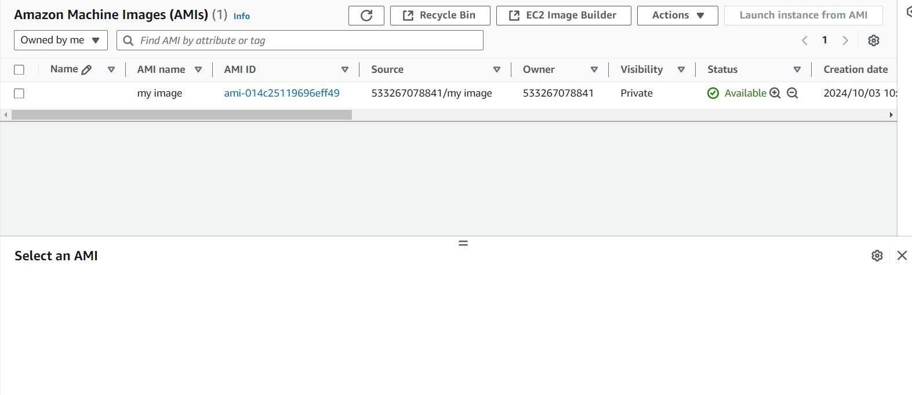

# Task 
## Launch a 3  EC2 Instance with the configuration of t2.micro and install git and httpd in userdata

## you will the instance running

## connect the ec2 instance with terminal

## you will able to see the git and httpd packages installed

## access the application with the public ip address
 

### Backup of the server
Create a image of the ec2 instance

now Delete the 2 instance 

### Don't delete the isntance untill the image status is availabe.

### launch an ec2 instance with created image and connect to the ec2 instance and check the git and httpd package installed or not.

Access the application with the ip address.

# This is how we can take a backup of the instance